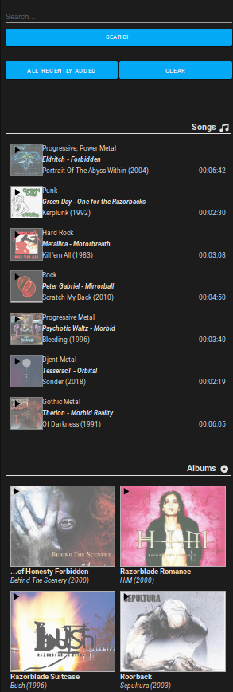

[![HACS Default][hacs_shield]][hacs]
[![Buy me a coffee][buy_me_a_coffee_shield]][buy_me_a_coffee]

[hacs_shield]: https://img.shields.io/static/v1.svg?label=HACS&message=Default&style=popout&color=green&labelColor=41bdf5&logo=HomeAssistantCommunityStore&logoColor=white
[hacs]: https://hacs.xyz/docs/default_repositories

[buy_me_a_coffee_shield]: https://img.shields.io/static/v1.svg?label=%20&message=Buy%20me%20a%20coffee&color=6f4e37&logo=buy%20me%20a%20coffee&logoColor=white
[buy_me_a_coffee]: https://www.buymeacoffee.com/jtbgroup

# Kodi-Search-Card

This card displays a search form to query the kodi entity.

This card is intented to be an alternative to an iframe containing Chorus.

| Search Form | Search Form |
| ---- | ---- |
|  |  |

## Requirements

This card requires a specific sensor that gets the data from Kodi. The sensor is provided by the custom component [Kodi Media Sensors](https://github.com/jtbgroup/kodi-media-sensors) (at least)

## Features

The card will let you search items in kodi.
You can display the recently added items.
You can directly play items in your kodi instance.

The search function will look for songs (title), albums (title), artists (name), movies (title), tvshows (title), PVR Channels (label) [only if a PVR client addon is present].

## Installation

1. Install the custom component [Kodi Media Sensors](https://github.com/jtbgroup/kodi-media-sensors).
2. Install the card using HACS

Manual installation is of course possible, but not explained here as there are plenty of tutorials.

## Card options

| Name | Type | Default | Since | Description |
|------|------|---------|-------|-------------|
| type | string	| **required** | v1.0.0 | `custom:kodi-search-card` |
| entity | string | **required** | v1.0.0 |  `sensor.kodi_media_sensor_search` |
| title | string | optional | v1.0.0 | The title of the card |
| show_thumbnail | boolean | `false` | v1.0.0 | Set to true if you want to show the thumbnails coming from kodi. Attention you can get problems when mixing http and https content; if so, leave it to false. |
| show_thumbnail_overlay| boolean | `true` | v2.1 | When true, adds an lightgrey overlay above the thumbnail; this might be useful to see better the play icon displayed above the thumbnail.
| show_thumbnail_border | boolean | `false` | v2.1 | When true, adds a 1px border around the thumbanils.
| outline_color | string | optional<br/>default: `white` | v2.1 | This option is only used when **show_thumbnail_border** is true. The color can be a string (ex: 'white', 'red', 'green', ... ), rgb format (ex: 'rgb(10, 12, 250)'), hexa format (ex: '#EE22FF') or even css variables).
| album_details_sort | string | Optional<br/> default: `Desc` | 2.5.0 | After a first search, you can drill down by clicking on an artist to see the all the albums. This list of albums can bes sorted based on the year of the album. Values can be `date_asc`, `date_desc`, `title_asc` or `title_desc`. |
| show_action_mode | boolean | `false` | 2.6.0 | This property tells whether or not to display the action mode component. If not visible, the default action mode will be used. |
| action_mode | string | Optional <br /> default: `play`| 2.6.0 | This property allows to choose between `add` or `play` as action when clicking on an item. The value is overridden by the value of the Action Mode component in the search form of the card. |
| add_position | integer | Optional<br /> default: `1` | 2.6.0 | This value indicates where to add an item in the playlist when the action_mode is `add` (in the card or in the configuration).<br/>0 = first position, 1 = second position, 1000 = 1001th position. To add an item as last position, use a value that is > than the size of the playlist.<br/> This parameters is only useful when selecting `add` as action mode (card configuration and/or search form of the card) |
| media_type_order<br />_[previously `order`]_  | List | Optional | 2.7.0 | This list allows you to change the order of media types in the resultset. The resultset is of course dependent on the configuration of the Integration (cfr configuration of the Kodi Media Sensors). The possible values are `song`, `album`, `artist`, `movie`, `tvshow`, `episode`, `channel` (this is the default order).<br /> The 2 types `episodedetails` and `albumdetails` are always shown at the end, but are not directly accessible when querying Kodi, but only via drill-down. So, no need to add them in the list. |

Example:

``` yaml
    type: custom:kodi-search-card
    entity: sensor.kodi_media_sensor_search
    title: What an amazing Card!!!
    show_thumbnail: true
    show_thumbnail_border: true
    show_thumbnail_overlay: true
    album_details_sort: title_desc
    show_action_mode: true
    action_mode: add
    outline_color: rgb(74,200,50)
    add_position: 3
    media_type_order:
        - movie
        - album
        - song
        - episode
```
